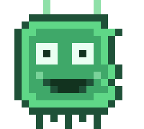

<p align="center"></p>

```
 ██╗  ██╗██╗██╗      ██████╗ ██████╗ ██╗   ██╗████████╗███████╗
 ██║ ██╔╝██║██║     ██╔═══██╗██╔══██╗╚██╗ ██╔╝╚══██╔══╝██╔════╝
 █████╔╝ ██║██║     ██║   ██║██████╔╝ ╚████╔╝    ██║   █████╗
 ██╔═██╗ ██║██║     ██║   ██║██╔══██╗  ╚██╔╝     ██║   ██╔══╝
 ██║  ██╗██║███████╗╚██████╔╝██████╔╝   ██║      ██║   ███████╗
 ╚═╝  ╚═╝╚═╝╚══════╝ ╚═════╝ ╚═════╝    ╚═╝      ╚═╝   ╚══════╝
        F R A M E W O R K  ·  bring your own model
```

<p align="center"><b>A cloud-first, brain-free AI agent harness — point it at any model and it does the work.</b></p>

<p align="center"><i>Orchestrator + specialist agents · real tools (shell, files, web, memory) · an offline reference bank · cross-session memory · an approval gate · a boxed, colored TUI — and <b>no bundled brain</b>. Bring your own GGUF, or drive it entirely from a cloud provider.</i></p>

---

## Why this framework beats the rest
- **It acts, it doesn’t just talk** — cloud and local models get the *same* real tools and are told, emphatically, that their tools execute on the machine. They work **until the task is done**, not until a step counter runs out.
- **Any model, one harness** — a local GGUF *or* 25 OpenAI-compatible cloud providers, swapped live.
- **Grounded** — an orchestrator commissions specialist agents (research, coding, security, systems, private) over an offline how-to bank, and the framework auto-recalls prior conversation, facts, and saved skills every turn.
- **Efficient** — bounded history, compacted tool results, and reasoning-token stripping keep cloud usage lean.
- **Production-ready** — one-command installer, versioned deploys with auto-rollback, 100+ tests, systemd.

## Install (all in one)
```bash
curl -fsSL https://raw.githubusercontent.com/citadelconsortium/kilobyte-framework/main/scripts/install.sh | sudo bash
kilo                 # then /gguf to load a downloaded model, or /cloud for a hosted one
```
The installer sets up the app, dependencies, and the service in a single pass. **No model is downloaded** — this framework ships without a brain.

## Bring your own model
- **A local GGUF** — download any GGUF (HuggingFace, etc.) into `~/` or `~/Downloads`, then run **`/gguf`** in the TUI to browse and load it. ⚠️ **Only load a model your machine can actually run** — the picker shows your free RAM, and a GGUF larger than that will fail to load or run unusably slow (a bad load auto-rolls-back to the previous brain). Or: `kilo brain deploy /path/to/model.gguf`.
- **A cloud model** (first-class here) — **`/cloud`** to pick a provider and paste a key: OpenRouter, OpenAI, Anthropic, Groq, DeepSeek, Together, Mistral, xAI, Gemini, Cerebras, Fireworks, Perplexity, Nebius, Hyperbolic, Ollama Cloud, Agnes AI, ModelScope, LLM7.io, OpenCode Zen, and GLHF.chat. These integrations use their documented OpenAI-compatible endpoints and Bearer authentication. Change a key anytime with **`/cloud key`**.

## Docs
See [`docs/`](docs/) — architecture and build notes carry over from [Kilobyte](https://github.com/citadelconsortium/kilobyte). The only difference in this repo is that **no brain is bundled**; everything else is the same framework.

---
<p align="center"><sub>Kilobyte Framework · © 0v3r51ght · free for commercial use</sub></p>
